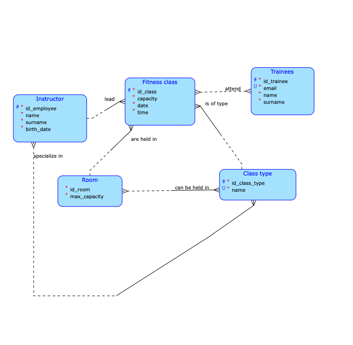

# FitnessApp (TJV Semestral Project)

> ⚠️ This project was created as part of coursework at **FIT CTU**  
> Please **do not copy or submit** it as your own if you're a student at any university.  
> Feel free to read and learn from it, but **plagiarism is a violation of academic integrity**.

---

## 🧠 Overview

This is a semestral project for course **B231 BI-TJV** at FIT CTU.  
It is a client-server application designed for a **fitness centre** to manage its fitness classes.

The application consists of two components:

- 🧩 **Backend**: built with **Java + Spring Boot**, providing a REST API and handling business logic and persistence.
- 📱 **Frontend**: a native **iOS app written in Swift**, using the **MVVM-C architecture**, serving as the client interface for managing fitness classes.

---

## 🏋️ Theme

The fitness centre offers various **fitness classes** (e.g. yoga, aerobics), held in specific **rooms** at specific **times**, each with its own **capacity** and **instructor**.  
Key domain rules include:

- Each room can hold one class at a time and only certain types of classes.
- Each instructor can lead multiple classes but only one at a time.
- Trainees can sign up for classes until capacity is full.
- A trainee can attend multiple classes, but only once per class.

---

## 🌐 Client–Server Design

The **iOS frontend** allows the fitness centre to:

- View all scheduled classes
- Filter by:
  - Availability (free capacity)
  - Date ranges
  - Instructor
  - Class type
- Add new classes, instructors, and trainees
- Automatically enforce scheduling rules (available rooms/instructors)

> ❌ Note: The app **does not handle trainee sign-ups** for classes.

---

## 🔍 Complex Querying

Advanced filters are supported, such as:

- "All yoga classes led by instructor X between Sept 1 and Sept 30"
- Validation when adding classes (e.g. suitable room/instructor availability at given time)

Creating a new class requires checking:
- Suitable rooms (for class type)
- Availability of both room and instructor
- Date/time overlaps

---

## 📁 Project Structure
Main components of the project
<pre>

fitnessApp/
├── backend/                  # Java backend (Spring Boot)
│   ├── build.gradle          # Gradle build file with dependencies
│   └── src/
│       ├── main/
│       │   ├── java/         # Application logic (controllers, services, etc.)
│       │   └── resources/    # Config (e.g. application.yml)
│       └── test/
│           ├── java/         # Unit and integration tests
│           └── resources/    # Test setup: mock data, in-memory DB
├── frontend/                 # Native iOS app (Swift, MVVM-C)
│   └── fitnessApp/
│       ├── App/              # Dependency injection & flow coordinators
│       ├── AppUI/            # Global UI: custom views, modifiers, alerts, ...
│       ├── Core/             # Data models, error handling, storage
│       ├── Environment/      # Static constants and app config
│       ├── Features/         # Individuál screens (Views and ViewModels)
│       ├── Services/         # Networking, logging, managers
│       ├── AppDelegate.swift # Entry point – starts AppFlowCoordinator
│       ├── AppFlowCoordinator.swift
│       └── Info.plist        # iOS app metadata and config
├── modeling/
│   └── ER/                   # Entity-Relation diagram and data model
│       ├── ER_diagram.png
│       └── *.json            
└── README.md
</pre>

---

## 🧪 Testing

Backend unit and integration tests are written in Java and run with Gradle using JaCoCo for code coverage.  
Frontend tests are not part of this project scope.
