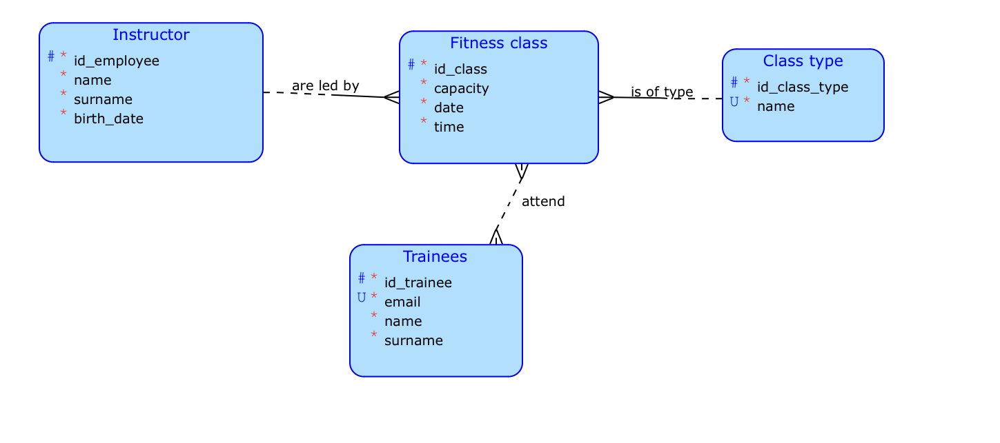

# TJV

This is a repository for the semestral work for B231 BI-TJV.

## Theme

This semestral work is about a fitness centre, which provides fitness classes for trainees that are signed up in their system.
Fitness classes are an instance of a class type occurring at particular date and time. 
Class types are for example yoga, aerobik, etc.
Fitness classes can be attended by any number of people up until its capacity. Trainees can attend multiple classes, of course they can only sign up for one class once, and the class must have a free capacity.
Fitness classes are lead by exactly one instructor (an employee of the fitness centre), each instructor can lead multiple fitness classes. 

## Klient server

Web server for people to see list of available classes, filter by date and time, by capacity, etc. I could also implement sign up process, this will depend on how much time I will have towards the end of semester.

## More complex query

I would like to implement filter for trainees to search for classes with free capacity.